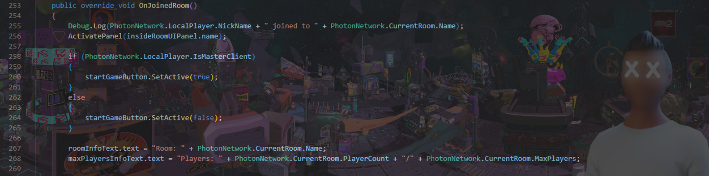

<!-- PROFILE PICTURE -->

 

<!-- TABLE OF CONTENTS -->

  
Table of Contents

  <ol>
    <li><a href="#about-me">About Me</a></li>
    <li><a href="#projects">Projects</a></li>
    <li><a href="#what-i-am-learning">What I Am Learning</a></li>
    <li><a href="#contact">Contact</a></li>
  </ol>

<!-- ABOUT ME -->
## About Me
</a> 
I am a 🎮 developer that focuses on the logic and mechanics of the game, I mainly work using Unity Game Engine. 
My core is in C# programming, currently learning the basic ropes of Web Development.
 
 
![toplanguage][toplang-shield]
 
![api][api-shield]

<!-- ONGOING PROJECTS -->
## Projects

<ul>
   <li>Multiplayer Third Person Shooter Using Unity and Photon Network: <strong><a href="https://badape.io/another-dimension/">Bad Ape Another Dimension</a></strong></li>
   <li>Works with <strong><a href="https://www.youtube.com/c/weareedt">weareEDT</a></strong> using: 
   <ul>
      <li> Unity </li>
      <li> Unreal Engine </li>
      <li> Spark AR </li>
      <li> HTC Vive, Oculus Quest 1 & 2, Valve Index </li>
   </ul>
</ul>

[![Youtube][youtube-shield]][youtube-url]

<!-- GETTING STARTED -->
## What I Am Learning
![Photon][photon-shield]
![Unreal Engine][unreal-shield]
![html5][html5-shield]
![css3][css3-shield]

<!-- CONTACT -->
## Connect

  
  

(<a href="#readme-top">back to top</a>)

<!-- MARKDOWN LINKS & IMAGES -->
<!-- https://www.markdownguide.org/basic-syntax/#reference-style-links -->
<!-- https://dev.to/envoy_/150-badges-for-github-pnk -->
[twitter-shield]: https://img.shields.io/badge/Twitter-1DA1F2?style=for-the-badge&logo=twitter&logoColor=white
[twitter-url]: https://twitter.com/its_danisauraus
[linkedin-shield]: https://img.shields.io/badge/-LinkedIn-black.svg?style=for-the-badge&logo=linkedin&colorB=555
[linkedin-url]: https://linkedin.com/in/hamdanbasri
[youtube-shield]: https://img.shields.io/badge/YouTube-FF0000?style=for-the-badge&logo=youtube&logoColor=white
[youtube-url]: https://www.youtube.com/c/weareedt
[html5-shield]: https://img.shields.io/badge/HTML5-E34F26?style=for-the-badge&logo=html5&logoColor=white
[css3-shield]: https://img.shields.io/badge/CSS3-1572B6?style=for-the-badge&logo=css3&logoColor=white
[c#-shield]: https://img.shields.io/badge/C%23-239120?style=for-the-badge&logo=c-sharp&logoColor=white
[unity-shield]: https://img.shields.io/badge/Unity-100000?style=for-the-badge&logo=unity&logoColor=white
[made-with-unity-shield]: https://img.shields.io/badge/Made%20with-Unity-57b9d3.svg?style=for-the-badge&logo=unity
[unity-url]: https://unity3d.com
[unreal-shield]: https://img.shields.io/badge/unrealengine-%23313131.svg?style=for-the-badge&logo=unrealengine&logoColor=white
[photon-shield]: https://img.shields.io/badge/-PhotonEngine-blue?style=for-the-badge
[vscode-shield]: 	https://img.shields.io/badge/Visual_Studio_Code-0078D4?style=for-the-badge&logo=visual%20studio%20code&logoColor=white
[toplang-shield]: https://github-readme-stats.vercel.app/api/top-langs/?username=hamdanbasri&theme=chartreuse-dark
[api-shield]: https://github-readme-stats.vercel.app/api?username=hamdanbasri&theme=chartreuse-dark
